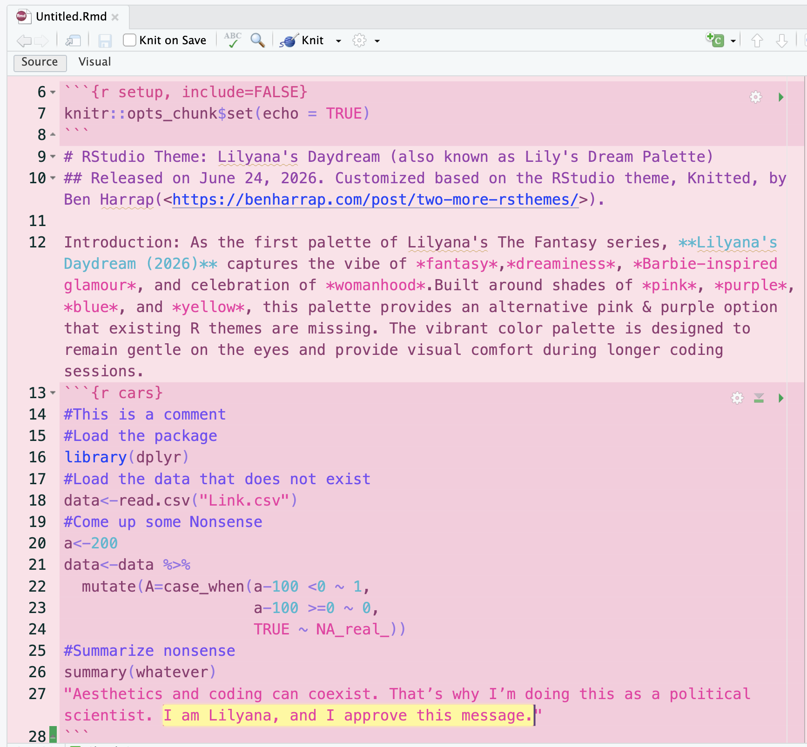
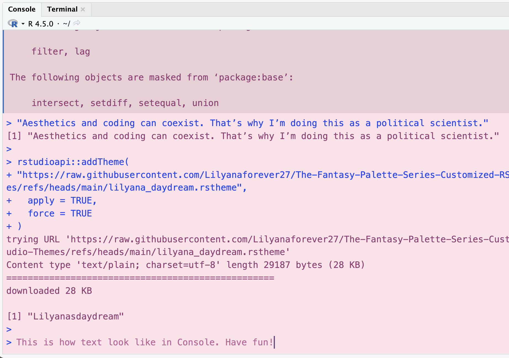

# The Fantasy Palette Series Customized RStudio Themes🌸🌸🌸
The Fantasy Palette Series is a collection of customized RStudio themes inspired by fantasy, cosmetics, and color palettes. Initiated on June 23, 2026, the series is based on Ben Harrap’s RStudio theme Knitted (&lt;https://benharrap.com/post/two-more-rsthemes/>). Many thanks to Ben!

**1. Lilyana's Daydream (aka Lily's Dream, June 24,2026)**: As the first palette of Lilyana's The Fantasy series, **Lilyana's Daydream (2026)** captures the vibe of *fantasy*,*dreaminess*, *Barbie-inspired glamour*, and celebration of *womanhood*.Built around shades of *pink*, *purple*, *blue*, and *yellow*, this palette provides an alternative pink & purple option that existing R themes are missing. The vibrant color palette is designed to remain gentle on the eyes and provide visual comfort during longer coding sessions.

**2. Kiana's Summer (coming soon in Summer)**: The second palette, Kiana’s Summer, is designed for Lilyana’s friend. It combines different shades of blue to evoke the imagery *beach*, *ocean*, and *calmness*.


# How to apply the RStduio Theme
Option 1: Install via URL
1. Click the `.rstheme` file you would like to install.
2. Click **Raw** in the upper-right corner.
3. Copy the URL from your browser's address bar. The URL should look like something like: https://raw.githubusercontent.com/Lilyanaforever27/The-Fantasy-Palette-Series-Customized-RStudio-Themes/refs/heads/main/lilyana_daydream.rstheme
4. Open RStudio and run the code below:
```r
rstudioapi::addTheme(
  "PASTE_THE_RAW_URL_HERE",
  apply = TRUE,
  force = TRUE)
```
5. 🎉 Success! Congrats, you did it!!! Welcome to the Fantasy Palette Series. 🌸

Option 2: 
Download the `.rstheme` file.
2. Open **RStudio**.
3. Go to **Tools → Global Options → Appearance**.
4. Click **Add...**.
5. Select the downloaded `.rstheme` file.
6. Choose the theme under **Editor theme**.
7. Click **Apply** or **OK**.
8. 🎉 Success! Congrats, you did it!!! Welcome to the Fantasy Palette Series. 🌸

# Themes Preview
### 1. Lilyana's Daydream (2026)




